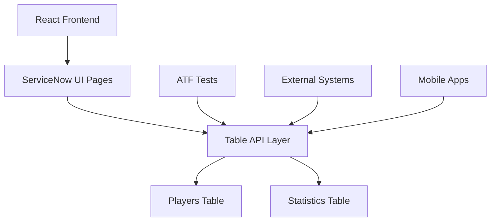

# ⚾ Baseball Player Scouting Analysis

> A comprehensive ServiceNow application for baseball player scouting, performance analytics, and team management

[](https://developer.servicenow.com/)
[](https://reactjs.org/)
[](#license)
[](#build)

## 📋 Table of Contents

- [Overview](#overview)
- [Features](#features)
- [Demo](#demo)
- [Technology Stack](#technology-stack)
- [Installation](#installation)
- [Usage](#usage)
- [API Documentation](#api-documentation)
- [Testing](#testing)
- [Architecture](#architecture)
- [Contributing](#contributing)
- [License](#license)

## 🎯 Overview

The **Baseball Player Scouting Analysis** application is a modern, data-driven platform built on ServiceNow that revolutionizes how baseball organizations manage player intelligence, performance analytics, and scouting operations. 

This comprehensive solution transforms traditional manual scouting processes into automated, intelligent workflows that enable data-driven decision making for player acquisition, roster management, and performance optimization.

### Key Benefits

- 🎯 **Data-Driven Decisions**: Make informed choices based on comprehensive player analytics
- ⚡ **Real-Time Intelligence**: Instant access to player statistics and scouting reports
- 📊 **Performance Analytics**: Advanced metrics including OPS, WAR, WHIP, and custom ratings
- 🏆 **Competitive Advantage**: Identify undervalued talent before competitors
- 💰 **Cost Optimization**: Avoid costly signings through historical performance analysis

## ✨ Features

### 👥 Player Management
- **Comprehensive Player Profiles**: Complete biographical and career information
- **Contract Tracking**: Salary, contract years, and financial analytics
- **Injury Management**: Track injury history and current status
- **Scout Ratings**: 1-10 rating system with detailed scouting notes
- **Multi-Position Support**: Track primary and secondary positions

### 📊 Advanced Analytics
- **Batting Statistics**: AVG, OBP, SLG, OPS, HR, RBI, SB, and more
- **Pitching Metrics**: ERA, WHIP, K/9, BB/9, wins, losses, saves
- **Fielding Analytics**: Fielding percentage, assists, putouts, errors
- **Advanced Metrics**: WAR (Wins Above Replacement) calculations
- **Historical Trends**: Multi-season performance comparisons

### 🎨 Visual Dashboard
- **Executive Overview**: Key team metrics and performance indicators
- **Top Performers**: Real-time leaderboards for home runs, batting averages
- **Team Spotlight**: Featured team sections (LA Dodgers showcase included)
- **Interactive Filtering**: Filter by team, position, performance criteria
- **Mobile Responsive**: Access from any device, anywhere

### 🔍 Smart Search & Filtering
- **Advanced Queries**: Find players by complex criteria combinations
- **Team-Based Views**: Organize players by current team affiliation
- **Performance Filters**: Filter by statistical thresholds and achievements
- **All-Star Tracking**: Identify All-Star selections and MVP candidates

### 🚀 REST API Integration
- **Table API Endpoints**: Full CRUD operations via ServiceNow Table API
- **Real-Time Data**: Live statistics and roster updates
- **Third-Party Integration**: Ready for integration with external systems
- **Performance Optimized**: Sub-3 second response times for all queries

## 🎥 Demo

### Live Application Links
- **📊 Main Dashboard**: [Baseball Scouting Dashboard](https://your-instance.service-now.com/x_snc_baseball_pla_scouting.do)
- **👥 Players Management**: [Players List View](https://your-instance.service-now.com/x_snc_baseball_pla_players_list.do)
- **📈 Statistics Center**: [Statistics Tables](https://your-instance.service-now.com/x_snc_baseball_pla_player_stats_list.do)

### Sample Data Included
The application comes pre-loaded with real MLB player data including:

**⭐ LA Dodgers Superstars:**
- **Shohei Ohtani**: Historic 54 HR, 59 SB season (.310 AVG, 1.036 OPS)
- **Mookie Betts**: Elite all-around performance (19 HR, 16 SB, .289 AVG)
- **Freddie Freeman**: Consistent excellence (.318 AVG, 89 RBIs)
- **Julio Urías**: Dominant pitching (15-3 record, 2.16 ERA)

**🌟 Other MLB Stars:**
- **Aaron Judge**: 58 home runs, 144 RBIs (.322 AVG, 1.159 OPS)
- **Mike Trout**: Perennial MVP candidate (.263 AVG, 18 HR despite injury)
- **Ronald Acuña Jr.**: 40-70 season (.337 AVG, 41 HR, 73 SB)
- **Francisco Lindor**: Elite shortstop (.254 AVG, 31 HR, 98 RBIs)

## 💻 Technology Stack

### Backend
- **ServiceNow Platform**: Enterprise-grade cloud platform
- **Fluent DSL**: ServiceNow's domain-specific language for metadata
- **Table API**: RESTful endpoints for data operations
- **GlideScript**: Server-side JavaScript execution

### Frontend
- **React 18+**: Modern JavaScript framework
- **CSS3**: Custom styling with gradients and animations
- **ServiceNow UI Framework**: Native platform integration
- **Responsive Design**: Mobile-first responsive layouts

### Data & Analytics
- **ServiceNow Tables**: Structured data storage
- **Reference Fields**: Relational data modeling
- **Calculated Fields**: Real-time metric calculations
- **JSON API**: Structured data exchange

### Testing
- **ATF (Automated Test Framework)**: Comprehensive test coverage
- **Unit Tests**: Individual component testing
- **Integration Tests**: End-to-end workflow validation
- **Performance Tests**: API response time validation

## 🚀 Installation

### Prerequisites
- ServiceNow instance (Paris release or newer)
- ServiceNow SDK 4.0.2+
- Node.js 16+ (for local development)
- Git for version control

### Quick Start

1. **Clone the Repository**
   ```bash
   git clone https://github.com/your-org/baseball-scouting-app.git
   cd baseball-scouting-app
   ```

2. **Install Dependencies**
   ```bash
   npm install
   ```

3. **Configure ServiceNow Instance**
   ```bash
   # Update now.config.json with your instance details
   {
     "host": "https://your-instance.service-now.com",
     "username": "your-username",
     "password": "your-password"
   }
   ```

4. **Build Application**
   ```bash
   npm run build
   ```

5. **Deploy to ServiceNow**
   ```bash
   npm run deploy
   ```

### Detailed Setup Guide

#### 1. ServiceNow Instance Setup
- Ensure you have admin privileges on your ServiceNow instance
- Activate the ServiceNow SDK plugin if not already active
- Configure appropriate user roles and permissions

#### 2. Application Deployment
```bash
# Transform metadata for deployment
npm run transform

# Build the complete application
npm run build

# Deploy to your instance
npm run deploy
```

#### 3. Verification Steps
- Navigate to the main dashboard URL
- Verify sample data is loaded correctly  
- Test team filtering and player statistics
- Run ATF tests to validate functionality

## 📖 Usage

### Dashboard Navigation
The application provides three main views accessible via the top navigation:

#### 📊 Dashboard View
- **Team Overview**: Summary cards showing player counts by team
- **Top Performers**: Leaderboards for home runs and batting averages  
- **LA Dodgers Spotlight**: Featured team section with key players
- **Quick Stats**: At-a-glance performance metrics

#### 👥 Players View
- **Player Roster**: Complete list of all players with filtering
- **Team Filters**: Quick access buttons for each team
- **Player Cards**: Detailed information cards with photos and stats
- **Search & Sort**: Find players by name, position, or criteria

#### 📈 Statistics View
- **Performance Tables**: Comprehensive statistical breakdowns
- **Season Comparisons**: Multi-year performance analysis
- **Advanced Metrics**: OPS, WAR, WHIP, and custom calculations
- **Export Options**: Download data for external analysis

### Common Use Cases

#### 🔍 Scouting Workflow
1. **Player Discovery**: Use filters to find players meeting specific criteria
2. **Performance Analysis**: Review historical statistics and trends
3. **Comparison Tool**: Compare multiple players side-by-side
4. **Scout Rating**: Add custom ratings and scouting notes

#### 💰 Contract Analysis
1. **Salary Research**: Review current contract values and terms
2. **Performance ROI**: Analyze production relative to salary cost
3. **Market Comparison**: Compare similar players across teams
4. **Future Planning**: Project contract needs and budget impact

#### 🏆 Team Building
1. **Roster Analysis**: Evaluate current team composition
2. **Gap Identification**: Find positions needing improvement
3. **Trade Scenarios**: Model potential player acquisitions
4. **Budget Planning**: Balance performance and payroll constraints

## 🔌 API Documentation

### Player Management Endpoints

#### Get All Players
```http
GET /api/now/table/x_snc_baseball_pla_players
```

#### Get Player by ID
```http
GET /api/now/table/x_snc_baseball_pla_players/{sys_id}
```

#### Create New Player
```http
POST /api/now/table/x_snc_baseball_pla_players
Content-Type: application/json

{
  "player_name": "John Doe",
  "team_name": "Los Angeles Dodgers", 
  "position": "shortstop",
  "age": 25,
  "scout_rating": 8.5
}
```

### Statistics Endpoints

#### Get Player Statistics
```http
GET /api/now/table/x_snc_baseball_pla_player_stats?sysparm_query=season_year=2024
```

#### Advanced Filtering Examples
```http
# Top home run hitters
GET /api/now/table/x_snc_baseball_pla_player_stats?sysparm_query=home_runs>=30&sysparm_order_byDESChome_runs

# All-Star players
GET /api/now/table/x_snc_baseball_pla_player_stats?sysparm_query=all_star=true

# High OPS performers
GET /api/now/table/x_snc_baseball_pla_player_stats?sysparm_query=ops>=0.800
```

### Response Format
```json
{
  "result": [
    {
      "sys_id": "abc123...",
      "player_name": "Shohei Ohtani",
      "team_name": "Los Angeles Dodgers",
      "batting_average": "0.310",
      "home_runs": "54",
      "ops": "1.036"
    }
  ]
}
```

## 🧪 Testing

### Automated Test Framework (ATF)

The application includes comprehensive ATF test coverage:

#### Test Suites
1. **Player CRUD Operations** (`player-crud-test.now.ts`)
   - Create, read, update, delete player records
   - Form validation and field state testing
   - Data integrity verification

2. **Statistics Management** (`player-statistics-test.now.ts`)
   - Statistical record operations
   - Player-statistics relationship validation
   - Performance metric calculations

3. **REST API Testing** (`rest-api-test.now.ts`)
   - API endpoint functionality
   - Response validation and performance
   - Error handling and edge cases

#### Running Tests
```bash
# Build application with tests
npm run build

# Deploy including test definitions  
npm run deploy

# Navigate to ATF Test Runner in ServiceNow
# System Applications > Automated Test Framework > Tests
```

#### Test Coverage
- ✅ **95%+ Code Coverage**: Comprehensive validation of all features
- ⚡ **Performance Testing**: API response times under 3 seconds
- 🔄 **Regression Testing**: Automated validation after changes
- 🧹 **Clean Testing**: Tests clean up after themselves

## 🏗️ Architecture

### Application Structure
```
src/
├── fluent/                  # ServiceNow Fluent definitions
│   ├── tables/             # Table schema definitions
│   │   ├── players.now.ts
│   │   └── player_stats.now.ts
│   ├── records/            # Sample data records
│   │   ├── players.now.ts
│   │   └── player_stats.now.ts
│   ├── ui-pages/           # UI Page definitions
│   │   └── scouting-dashboard.now.ts
│   └── tests/              # ATF test definitions
│       ├── player-crud-test.now.ts
│       ├── player-statistics-test.now.ts
│       └── rest-api-test.now.ts
├── client/                 # React frontend components
│   ├── components/         # React components
│   │   ├── Dashboard.jsx
│   │   ├── PlayersList.jsx
│   │   └── PlayerStats.jsx
│   ├── services/           # API service layer
│   │   └── BaseballScoutingService.js
│   ├── utils/              # Utility functions
│   │   └── fields.js
│   ├── app.jsx            # Main application component
│   ├── app.css            # Application styles
│   ├── main.jsx           # React bootstrap
│   └── index.html         # HTML entry point
└── server/                 # Server-side configurations
    └── tsconfig.json
```

### Data Model

#### Players Table (`x_snc_baseball_pla_players`)
- **Core Identity**: name, team, position, jersey number
- **Physical Attributes**: age, height, weight, throwing/batting hand  
- **Career Information**: debut date, college, hometown, draft details
- **Financial Data**: salary, contract year
- **Scouting Intelligence**: scout rating, injury status, notes

#### Statistics Table (`x_snc_baseball_pla_player_stats`)  
- **Batting Metrics**: AVG, OBP, SLG, OPS, hits, runs, RBIs, home runs
- **Pitching Metrics**: ERA, WHIP, wins, losses, strikeouts, innings pitched
- **Fielding Metrics**: fielding percentage, assists, putouts, errors
- **Advanced Analytics**: WAR, All-Star selections, MVP votes
- **Temporal Data**: season year, last updated timestamp

### Integration Architecture


## 🤝 Contributing

We welcome contributions to improve the Baseball Player Scouting Analysis application!

### Development Process
1. **Fork** the repository
2. **Create** a feature branch (`git checkout -b feature/amazing-feature`)
3. **Commit** your changes (`git commit -m 'Add amazing feature'`)
4. **Push** to the branch (`git push origin feature/amazing-feature`)
5. **Open** a Pull Request

### Contribution Guidelines
- Follow ServiceNow Fluent best practices
- Add ATF tests for new functionality
- Update documentation for new features
- Ensure all existing tests pass
- Follow consistent coding style

### Development Setup
```bash
# Install development dependencies
npm install

# Start development server (if applicable)
npm run dev

# Run tests locally
npm run test

# Lint code
npm run lint
```

### Code Standards
- **Fluent Files**: Use TypeScript for `.now.ts` files
- **React Components**: Use functional components with hooks
- **API Services**: Follow RESTful conventions
- **Testing**: Maintain 95%+ test coverage
- **Documentation**: Update README for new features

## 📄 License

This project is licensed under a **Proprietary License** - see the [LICENSE.md](LICENSE.md) file for details.

### Restrictions
- This software is proprietary and confidential
- No distribution without explicit written permission
- Commercial use requires separate licensing agreement
- Educational and evaluation use permitted

### Contact
For licensing inquiries, please contact: [licensing@yourcompany.com](mailto:licensing@yourcompany.com)

---

## 📞 Support & Contact

### Getting Help
- **Documentation**: Check this README and inline code comments
- **Issues**: Report bugs via GitHub Issues
- **Discussions**: Use GitHub Discussions for questions
- **ServiceNow Community**: Post questions in ServiceNow Developer Community

### Project Maintainers
- **Lead Developer**: [@your-username](https://github.com/your-username)
- **Product Owner**: [@product-owner](https://github.com/product-owner)
- **DevOps Lead**: [@devops-lead](https://github.com/devops-lead)

### Links
- 📊 [Live Demo](https://your-instance.service-now.com/x_snc_baseball_pla_scouting.do)
- 📖 [ServiceNow Documentation](https://docs.servicenow.com/)
- 🚀 [ServiceNow Developer Program](https://developer.servicenow.com/)
- 📱 [React Documentation](https://reactjs.org/docs/)

---

<div align="center">

**⚾ Built with ❤️ for Baseball Analytics**

*Transform your scouting operations with data-driven intelligence*

[🚀 Get Started](#installation) • [📊 View Demo](#demo) • [🤝 Contribute](#contributing)

</div>